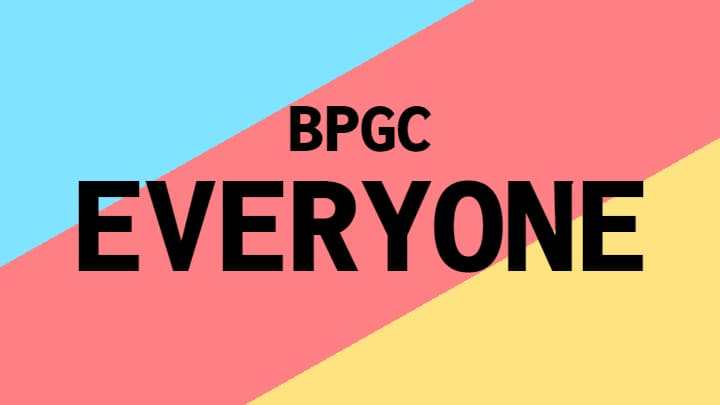

# BPGC Everyone

This is the repository for [BPGC Everyone](https://bpgc-everyone-remastered.netlify.app) - A tool to find anyone who was, is, or will be in BITS Goa. 

# About This Project

This is the remastered edition of the previous version of [BPGC Everyone](https://bpgc-everyone.netlify.app).
Having seen [this video](https://www.youtube.com/watch?v=TsTt7Tja30Q&ab_channel=JamstackTV) and inspired by Chrome's Developer Advocates, I wanted to push the limits of what's possible with this site.
BPGC Everyone supports **ancient** browser versions and works on all operating systems to give the people of my college the best possible experience.

# Tech

This is a purely static site - no backend at all. 
It's built with vanilla JavaScript and vanilla CSS for UI components and [Rollup](https://github.com/rollup/rollup) to bundle it all up.